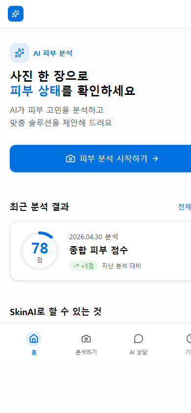
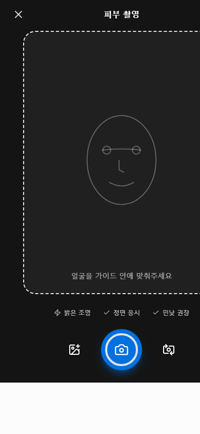
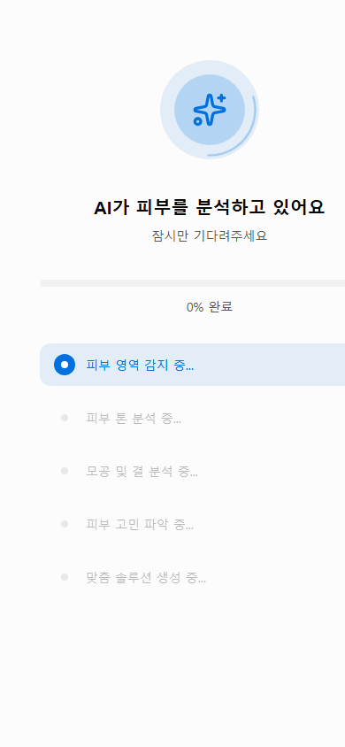
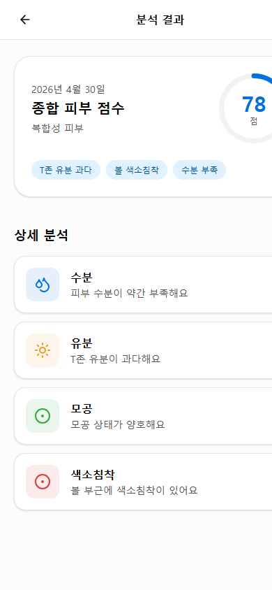
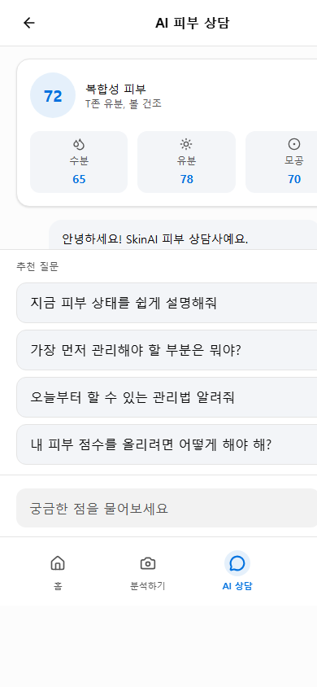
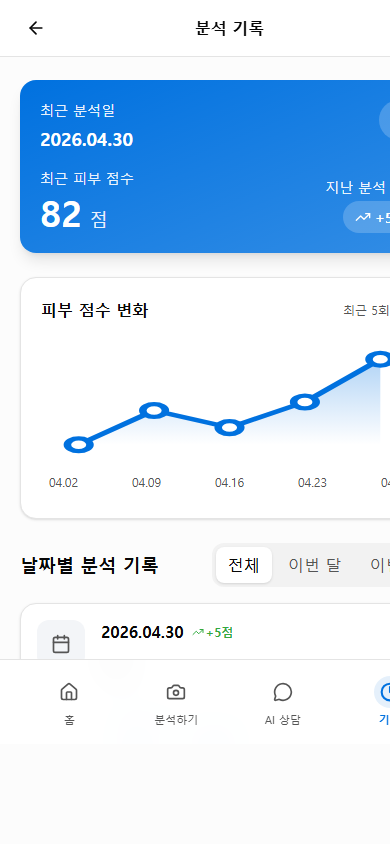

# SkinAI Vue

Vue 3 + Vite 기반 AI 피부 분석 데모 앱입니다. 사용자가 얼굴 사진을 촬영하거나 업로드하면 분석 진행 화면을 거쳐 피부 점수, 상세 지표, 추천 케어, AI 상담, 분석 기록을 확인할 수 있도록 구성되어 있습니다.

## 실행 방법

```bash
corepack pnpm install
corepack pnpm dev
```

개발 서버 실행 후 터미널에 표시되는 로컬 주소로 접속합니다.

## 주요 기술

- Vue 3
- Vite
- TypeScript
- Vue Router
- Tailwind CSS
- lucide-vue-next

## 페이지 구성

| 경로 | 페이지 | 역할 | 페이지 결과물 |
| --- | --- | --- | --- |
| `/` | 홈 | 앱의 시작 화면입니다. 피부 분석 시작, 최근 분석 결과, AI 상담, 분석 기록으로 이동할 수 있는 진입점을 제공합니다. | 메인 소개 문구, `피부 분석 시작하기` 버튼, 최근 분석 점수 카드, 기능 카드, 하단 탭 메뉴 |
| `/capture` | 피부 촬영 | 사용자가 피부 분석에 사용할 얼굴 이미지를 촬영하거나 갤러리에서 선택하는 전체 화면 카메라 UI입니다. | 얼굴 가이드 프레임, 촬영 조건 안내, 갤러리 선택 버튼, 촬영 버튼, 카메라 전환 버튼 |
| `/loading` | 분석 진행 | 촬영된 이미지를 AI가 분석하는 과정을 단계별로 보여주는 대기 화면입니다. | 원형 AI 아이콘 애니메이션, 진행률 바, 분석 단계 목록, 완료 후 결과 페이지 자동 이동 |
| `/result` | 분석 결과 | 피부 분석 결과를 종합 점수, 피부 타입, 세부 지표, 주요 고민, 추천 케어로 보여주는 화면입니다. | 78점 종합 피부 점수, 복합성 피부 타입, 주요 고민 태그, 수분/유분/모공/색소침착 상세 카드, AI 추천 케어 |
| `/chat` | AI 피부 상담 | 분석 결과를 바탕으로 사용자가 피부 관리 질문을 할 수 있는 채팅 화면입니다. | 분석 요약 카드, 추천 질문 버튼, AI 상담 메시지, 질문 입력창, 하단 탭 메뉴 |
| `/history` | 분석 기록 | 날짜별 피부 분석 기록과 점수 변화를 확인하는 화면입니다. | 최근 분석 요약 카드, 최근 5회 점수 변화 그래프, 전체/이번 달/이번 주 필터, 날짜별 분석 기록 |

## 실제 화면 미리보기

### 홈



홈 화면은 앱 진입점입니다. 사용자는 첫 화면에서 바로 피부 분석을 시작하거나 최근 분석 결과를 확인하고, 하단 탭으로 분석하기, AI 상담, 기록 화면으로 이동할 수 있습니다.

### 피부 촬영



피부 촬영 화면은 카메라 사용 흐름에 맞춘 전체 화면 UI입니다. 얼굴을 가이드 안에 맞추도록 안내하고, 밝은 조명, 정면 응시, 민낯 권장 조건을 함께 보여줍니다.

### 분석 진행



분석 진행 화면은 사용자가 기다리는 동안 현재 처리 단계를 확인할 수 있게 합니다. 피부 영역 감지, 피부 톤 분석, 모공 및 결 분석, 피부 고민 파악, 맞춤 솔루션 생성 순서로 진행됩니다.

### 분석 결과



분석 결과 화면은 최종 결과물입니다. 종합 피부 점수와 피부 타입을 먼저 보여주고, 주요 고민 태그와 상세 분석 카드를 통해 어떤 항목을 관리해야 하는지 확인할 수 있습니다.

### AI 피부 상담



AI 피부 상담 화면은 분석 결과를 바탕으로 추가 질문을 하는 공간입니다. 추천 질문을 선택하거나 직접 입력하면 피부 상태 설명, 우선 관리 항목, 오늘부터 할 수 있는 관리법 등을 답변합니다.

### 분석 기록



분석 기록 화면은 시간에 따른 피부 점수 변화를 보여주는 결과물입니다. 최근 점수, 지난 분석 대비 변화량, 최근 5회 그래프, 날짜별 상세 기록을 한 화면에서 확인할 수 있습니다.

## 사용자 흐름

1. 홈 화면에서 `피부 분석 시작하기`를 선택합니다.
2. 피부 촬영 화면에서 사진을 촬영하거나 이미지를 업로드합니다.
3. `분석하기`를 누르면 분석 진행 화면에서 처리 단계와 진행률을 확인합니다.
4. 분석이 완료되면 결과 화면에서 피부 점수와 맞춤 케어 추천을 확인합니다.
5. 추가 질문이 있으면 AI 피부 상담으로 이동합니다.
6. 분석 기록 페이지에서 이전 결과와 점수 변화를 확인합니다.

## 분석 결과 예시

- 종합 피부 점수: 78점
- 피부 타입: 복합성
- 주요 고민: T존 유분 과다, 볼 색소침착, 수분 부족
- 상세 지표:
  - 수분: 72점, 보통
  - 유분: 65점, 주의
  - 모공: 85점, 좋음
  - 색소침착: 68점, 보통
- 추천 케어:
  - 아침 세안 후 수분 토너 사용
  - 자외선 차단제 꼼꼼히 바르기
  - 주 2회 각질 케어 추천

## 분석 기록 예시

| 날짜 | 점수 | 변화 | 주요 개선 항목 |
| --- | ---: | ---: | --- |
| 2026.04.30 | 82점 | +5점 | 수분 개선, 모공 케어 |
| 2026.04.23 | 77점 | +3점 | 유분 조절, 색소 개선 |
| 2026.04.16 | 74점 | -2점 | 수분 관리 필요 |
| 2026.04.09 | 76점 | +4점 | 피부결 개선, 탄력 증가 |
| 2026.04.02 | 72점 | 0점 | 전체적 안정 |

## 폴더 구조

```text
src/
  components/   공통 UI 컴포넌트
  lib/          피부 분석 데모 데이터와 타입
  views/        라우트별 페이지 컴포넌트
  App.vue       앱 루트 컴포넌트
  main.ts       Vue 앱 진입점
  router.ts     페이지 라우팅 설정
  styles.css    전역 스타일
```
