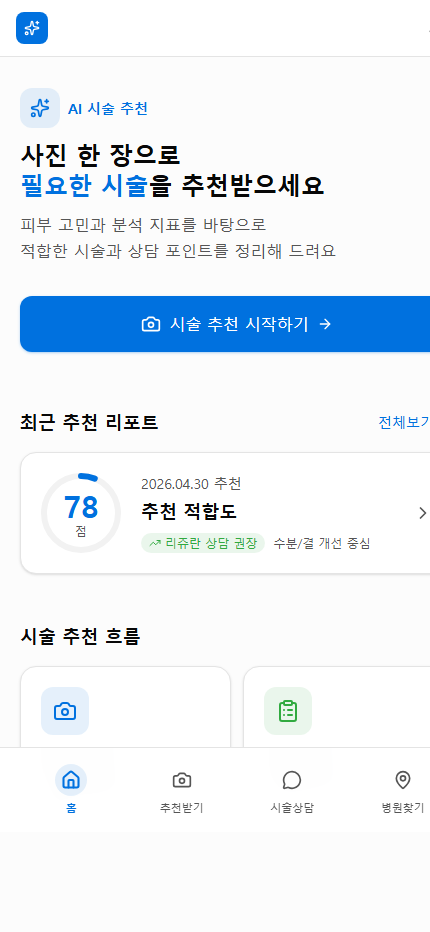
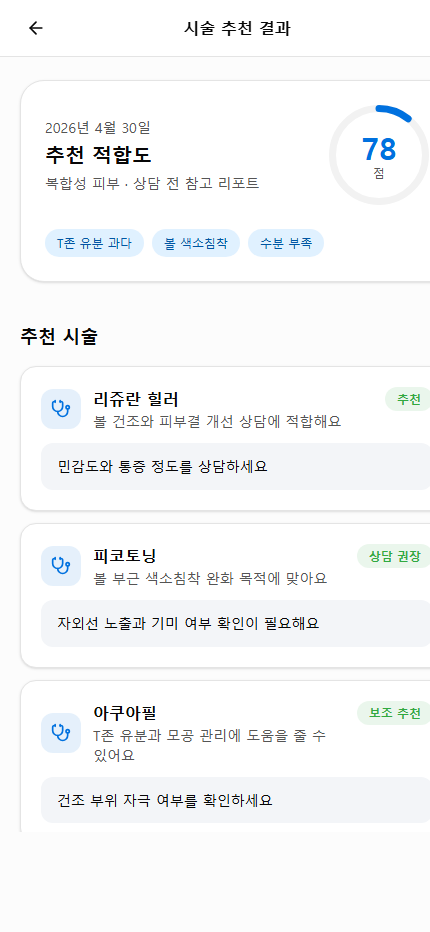
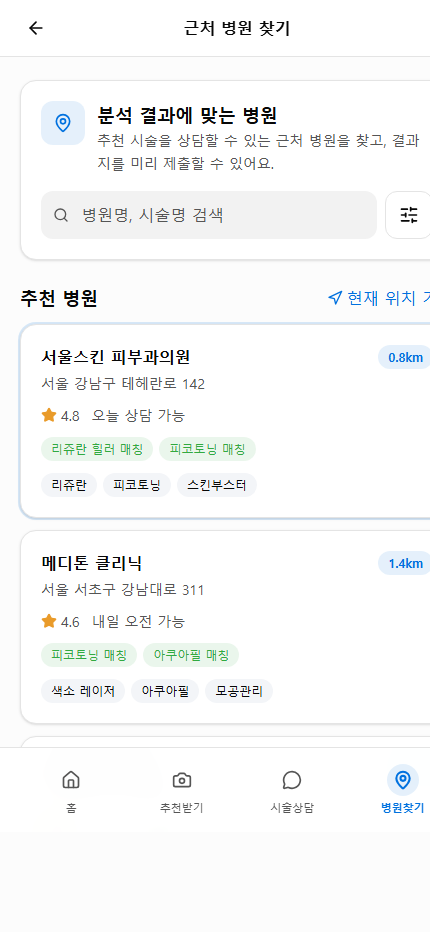

# SkinAI Vue

AI 피부 시술 추천을 데모로 구현한 Vue 3 프론트엔드 앱입니다. 사용자가 피부 사진을 촬영하거나 업로드하면 추천 분석 과정을 거쳐 피부 지표, 추천 시술, AI 시술 상담, 근처 병원 찾기, 병원 결과지 제출까지 이어지는 모바일 중심 흐름을 제공합니다.

현재 프로젝트는 백엔드 API 없이 동작하는 프론트엔드 데모입니다. 추천 결과, 상담 답변, 병원 목록, 분석 기록은 코드에 포함된 정적 데이터와 브라우저 `localStorage`를 사용합니다.

## 실행 방법

```bash
corepack pnpm install
corepack pnpm dev
```

개발 서버가 실행되면 터미널에 표시되는 로컬 주소로 접속합니다.

## 사용 가능한 명령어

```bash
corepack pnpm dev      # 개발 서버 실행
corepack pnpm lint     # TypeScript / Vue 타입 검사
corepack pnpm build    # 타입 검사 후 프로덕션 빌드
corepack pnpm preview  # 빌드 결과 미리보기
```

## 기술 스택

- Vue 3
- Vite
- TypeScript
- Vue Router
- Tailwind CSS v4
- lucide-vue-next

## 주요 기능

- 피부 사진 촬영 또는 이미지 업로드
- 분석 진행률과 단계별 추천 생성 과정 표시
- 피부 지표 기반 추천 시술 결과 제공
- AI 시술 상담 채팅 데모
- 추천 시술과 매칭되는 근처 병원 검색
- 선택한 병원에 분석 결과지 제출
- 제출한 병원 신청 현황을 홈 화면에 표시
- 날짜별 분석 기록과 점수 변화 확인

## 사용자 흐름

1. 홈 화면에서 `시술 추천 시작하기`를 누릅니다.
2. 촬영 화면에서 사진을 촬영하거나 갤러리 이미지를 선택합니다.
3. `시술 추천 받기`를 누르면 분석 진행 화면으로 이동합니다.
4. 분석이 완료되면 시술 추천 결과 화면에서 추천 적합도, 피부 지표, 추천 시술을 확인합니다.
5. 결과 화면에서 `추천 시술 상담하기` 또는 `근처 병원에 결과지 제출하기`로 이동합니다.
6. AI 상담 화면에서는 추천 시술 설명, 우선순위, 주의사항을 질문할 수 있습니다.
7. 병원 찾기 화면에서는 병원명 또는 시술명으로 검색하고, 선택한 병원에 결과지를 제출할 수 있습니다.
8. 병원 제출 내역은 홈 화면의 `병원 신청 현황`에 표시됩니다.
9. 분석 기록 화면에서 날짜별 점수와 변화 추이를 확인합니다.

## 페이지 구성

| 경로 | 화면 | 설명 |
| --- | --- | --- |
| `/` | 홈 | 시술 추천 시작, 최근 추천 리포트, 병원 신청 현황, 주요 기능 카드 제공 |
| `/capture` | 시술 추천 촬영 | 이미지 촬영/업로드, 촬영 가이드, 재촬영, 추천 분석 시작 제공 |
| `/loading` | 분석 진행 | 피부 영역 감지, 피부 톤 분석, 모공 및 결 분석, 상담 포인트 정리, 맞춤 시술 추천 생성 과정을 진행률로 표시 |
| `/result` | 시술 추천 결과 | 추천 적합도, 피부 타입, 주요 고민, 추천 시술, 피부 지표, 상담 전 체크리스트 표시 |
| `/chat` | AI 시술 상담 | 추천 시술 관련 질문과 데모 답변 제공, 상담 후 병원 찾기 이동 가능 |
| `/hospitals` | 근처 병원 찾기 | 추천 병원 목록, 검색, 시술 매칭 태그, 결과지 제출 항목 선택, 제출 완료 안내 제공 |
| `/history` | 분석 기록 | 최근 분석 점수, 점수 변화 그래프, 날짜별 분석 기록, 기간 필터 제공 |

## 병원 찾기 기능

`/hospitals` 화면은 현재 추천 결과와 연결되는 병원 찾기 및 결과지 제출 흐름을 담당합니다.

제공 기능:

- 병원명, 주소, 전문 분야, 매칭 시술 기준 검색
- 현재 위치 기준 추천 병원 UI
- 병원별 거리, 평점, 주소, 상담 가능 시간 표시
- 추천 시술 매칭 태그 표시
- 결과지 제출 항목 선택
- 제출 완료 안내 메시지 표시
- 제출 내역을 홈 화면의 병원 신청 현황에 반영

현재 등록된 데모 병원:

| 병원명 | 거리 | 평점 | 주소 | 매칭 시술 | 상담 가능 시간 |
| --- | ---: | ---: | --- | --- | --- |
| 서울스킨 피부과의원 | 0.8km | 4.8 | 서울 강남구 테헤란로 142 | 리쥬란 힐러, 피코토닝 | 오늘 상담 가능 |
| 메디톤 클리닉 | 1.4km | 4.6 | 서울 서초구 강남대로 311 | 피코토닝, 아쿠아필 | 내일 오전 가능 |
| 더맑은 피부의원 | 2.1km | 4.7 | 서울 강남구 도산대로 85 | 리쥬란 힐러 | 이번 주 상담 가능 |

결과지 제출 시 선택 가능한 항목:

- 추천 시술 목록
- 피부 점수와 지표
- 촬영 이미지

제출 데이터는 브라우저 `localStorage`의 `skinai:hospital-applications` 키에 저장됩니다. 저장 후 `skinai:hospital-application-updated` 이벤트를 발생시켜 홈 화면의 병원 신청 현황을 갱신합니다.

## 데모 데이터

### 추천 결과

- 추천 적합도: 78점
- 분석 날짜: 2026년 4월 30일
- 피부 타입: 복합성
- 주요 고민: T존 유분 과다, 볼 색소침착, 수분 부족

### 추천 시술

| 시술 | 추천 상태 | 추천 이유 | 상담 메모 |
| --- | --- | --- | --- |
| 리쥬란 힐러 | 추천 | 볼 건조와 피부결 개선 상담에 적합 | 민감도와 통증 정도 상담 필요 |
| 피코토닝 | 상담 권장 | 볼 부근 색소침착 완화 목적에 적합 | 자외선 노출과 기미 여부 확인 필요 |
| 아쿠아필 | 보조 추천 | T존 유분과 모공 관리에 도움 | 건조 부위 자극 여부 확인 필요 |

### 피부 지표

| 항목 | 점수 | 상태 | 설명 |
| --- | ---: | --- | --- |
| 수분 | 72 | 보통 | 피부 수분이 약간 부족 |
| 유분 | 65 | 주의 | T존 유분 과다 |
| 모공 | 85 | 좋음 | 모공 상태 양호 |
| 색소침착 | 68 | 보통 | 볼 부근 색소침착 |

### 분석 기록

| 날짜 | 점수 | 변화 | 주요 개선 항목 |
| --- | ---: | ---: | --- |
| 2026.04.30 | 82 | +5 | 수분 개선, 모공 케어 |
| 2026.04.23 | 77 | +3 | 유분 조절, 색소 개선 |
| 2026.04.16 | 74 | -2 | 수분 관리 필요 |
| 2026.04.09 | 76 | +4 | 피부결 개선, 탄력 증가 |
| 2026.04.02 | 72 | 0 | 전체적 안정 |

## 화면 미리보기

### 홈



홈 화면은 시술 추천 시작점입니다. 최근 추천 리포트와 주요 기능 카드가 표시되며, 병원 결과지를 제출한 뒤에는 병원 신청 현황도 함께 표시됩니다.

### 시술 추천 촬영


촬영 화면에서는 상담받고 싶은 부위가 잘 보이도록 사진을 촬영하거나 갤러리에서 이미지를 선택할 수 있습니다.

### 분석 진행


분석 진행 화면은 추천 결과를 생성하는 과정을 단계별 진행률로 보여줍니다.

### 시술 추천 결과



결과 화면에서는 추천 적합도와 피부 지표, 추천 시술, 상담 전 체크리스트를 확인할 수 있습니다.

### AI 시술 상담


상담 화면에서는 추천 질문 또는 직접 입력을 통해 시술 목적, 우선순위, 주의사항을 확인할 수 있습니다.

### 근처 병원 찾기



병원 찾기 화면에서는 추천 시술과 매칭되는 병원을 검색하고, 선택한 병원에 분석 결과지를 제출할 수 있습니다.

### 분석 기록


기록 화면에서는 최근 분석 점수, 점수 변화 그래프, 날짜별 기록을 확인할 수 있습니다.

## 프로젝트 구조

```text
src/
  components/   공통 UI 컴포넌트
  lib/          공통 타입, 분석 기록 데이터, 병원 신청 저장 유틸
  views/        라우트별 화면 컴포넌트
  App.vue       앱 루트 컴포넌트
  main.ts       Vue 앱 진입점
  router.ts     라우트 설정
  styles.css    Tailwind CSS v4 테마와 전역 스타일

public/         정적 이미지와 아이콘
readme-screens/ README 화면 미리보기 이미지
```

## 구현 참고 사항

- 실제 카메라 스트림은 연결되어 있지 않습니다. 촬영 버튼을 누르면 `/placeholder.jpg`를 촬영 결과처럼 사용합니다.
- 이미지 업로드는 브라우저 `FileReader`로 선택한 파일을 미리보기합니다.
- AI 상담은 외부 AI API가 아니라 질문 키워드에 따라 정해진 답변을 반환하는 데모 로직입니다.
- 병원 목록은 `src/views/HospitalView.vue`에 정의된 정적 데이터입니다.
- 병원 결과지 제출 내역은 서버가 아닌 브라우저 `localStorage`에만 저장됩니다.
- `apiList.md`는 현재 비어 있으며, 이 프로젝트에는 연결된 백엔드 API 명세가 없습니다.
